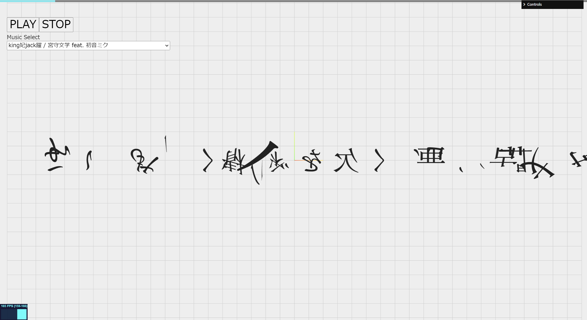

# Character-Split Sample -TextAlive-



TextAlive APIを使った、歌詞がアニメーションするものです。バラバラな文字が、形成されます。

## Demo

https://misora.main.jp/ea4azmyb/text/

## Getting Started
Download and install Node.js on your computer (https://nodejs.org/en/download/).

Then, open VSCODE, drag the project folder to it. Open VSCODE terminal and install dependencies (you need to do this only in the first time)
```
npm install
```

Run this command in your terminal to open a local server at localhost:8080
```
npm run dev
```

## Resource

Three.js

GSAP

TextAlive.api